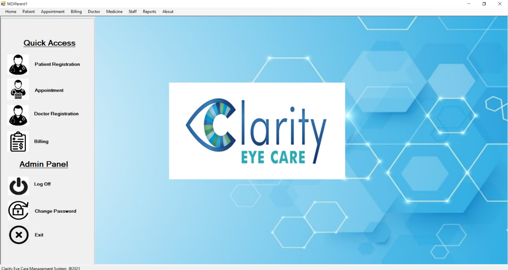
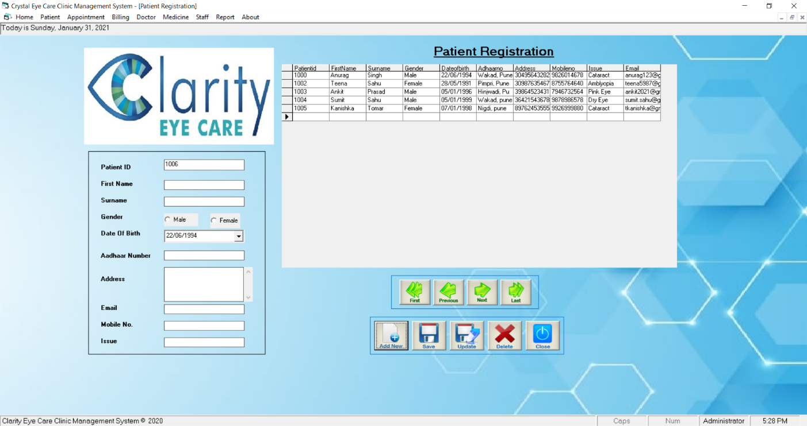
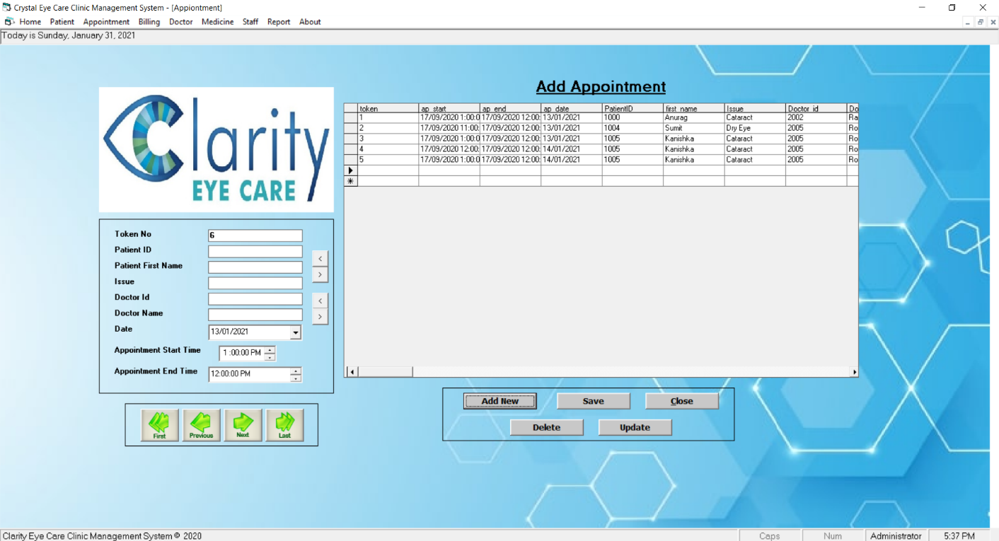
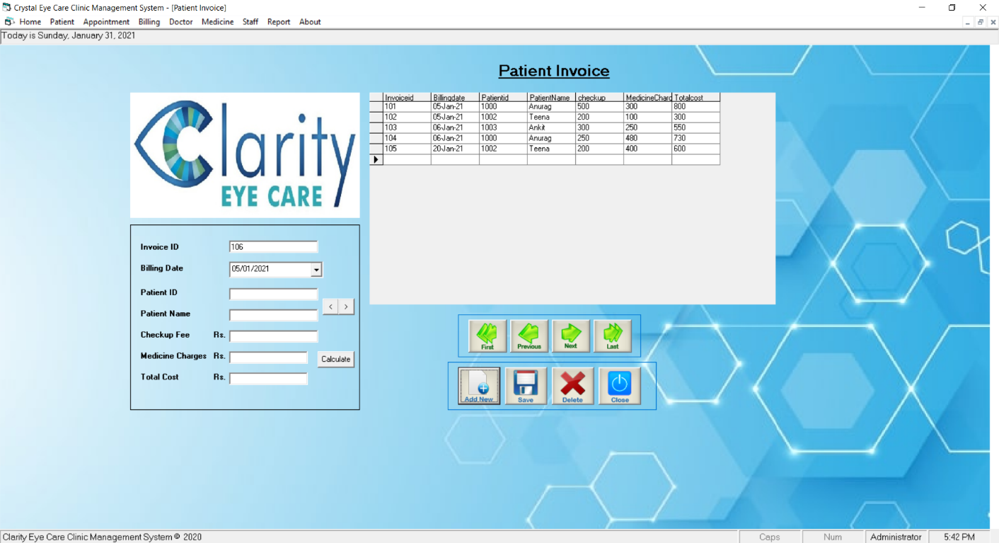

# Clinic-Management-System-

## General Info

>An end-to-end Clinic Management System that allows the admin to register patients, doctors, set up appointments, generate bills, reports and various other tasks associated with a clinic. Built using Visual Basic .NET framework.

### Screenshots:-

 

 

 

 

